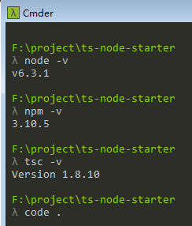
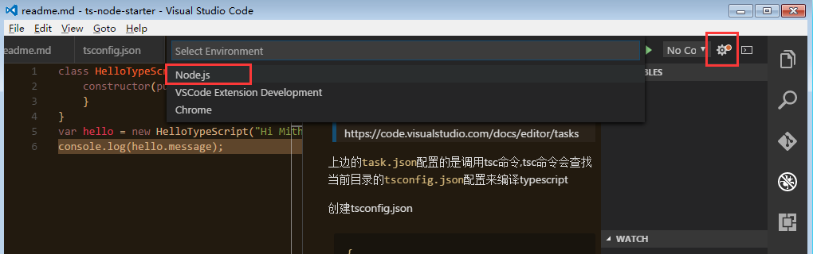

# 在VSCode上配置typescript + nodejs 开发环境

## 确认需要的都安装好了



## 配置编译任务

在VSCode中快捷键 `Ctrl + Shift + B`用来编译，对应的编译配置文件为`.vscode/task.json`

第一次按会弹出 `No task runner configured` 。点击`configure task runner` 开始配置。
选择`TypeScript with Watch Mode` 会在`.vscode`目录下自动创建`task.json`如下

 ```
{
    // See https://go.microsoft.com/fwlink/?LinkId=733558
    // for the documentation about the tasks.json format
    "version": "0.1.0",
    "command": "tsc",
    "isShellCommand": true,
    "args": ["-w", "-p", "."],
    "showOutput": "silent",
    "isWatching": true,
    "problemMatcher": "$tsc-watch"
}
 ```

有了这个`task.json`后每次`Ctrl + Shift + B` 即可调用`tsc`命令编译`typescript`。


>task配置的官方文档
>
>https://code.visualstudio.com/docs/editor/tasks

`tsc`命令会查找当前目录的`tsconfig.json`配置来编译`typescript`

### 创建tsconfig.json

`node`还不支持`es6`的`import`，所以还是先编译到`es5`

```
{
    "compilerOptions": {
        "target": "es5",
        "outDir": "build",
        "sourceMap": true
    }
}
```

>tsconfig.json的文档
>
>https://www.typescriptlang.org/docs/handbook/tsconfig-json.html

## Debug配置

`Ctrl + Shift + D` 点击配置图标，选择nodejs



会在.vscode目录下自动创建launch.json如下

```
{
    "version": "0.2.0",
    "configurations": [
        {
            "name": "Launch",
            "type": "node",
            "request": "launch",
            "program": "${workspaceRoot}/app.js",
            "stopOnEntry": false,
            "args": [],
            "cwd": "${workspaceRoot}",
            "preLaunchTask": null,
            "runtimeExecutable": null,
            "runtimeArgs": [
                "--nolazy"
            ],
            "env": {
                "NODE_ENV": "development"
            },
            "externalConsole": false,
            "sourceMaps": false,
            "outDir": null
        },
        {
            "name": "Attach",
            "type": "node",
            "request": "attach",
            "port": 5858,
            "address": "localhost",
            "restart": false,
            "sourceMaps": false,
            "outDir": null,
            "localRoot": "${workspaceRoot}",
            "remoteRoot": null
        },
        {
            "name": "Attach to Process",
            "type": "node",
            "request": "attach",
            "processId": "${command.PickProcess}",
            "port": 5858,
            "sourceMaps": false,
            "outDir": null
        }
    ]
}

```

修改上边的Launch部分几项，使VSCode认得`typescript`和`sourceMap`

```
"program": "${workspaceRoot}/app.ts",
"sourceMaps": true,
"outDir": "${workspaceRoot}/build"
```

这样就可以在`typescript`上打断点调试了

> debug的文档
>
> https://code.visualstudio.com/docs/editor/debugging

## 语法提示

命令

`typings install dt~node --global --save`

会安装node语法提示，并创建`typings.json`保存`.d.ts`的版本

```
{
  "globalDependencies": {
    "node": "registry:dt/node#6.0.0+20160807145350"
  }
}

```

> typings 文档
>
> https://github.com/typings/typings

现在全部配置完毕，可以开始用`typescript`写node了。

## 创建app.ts

```
import { createServer, Server, IncomingMessage, ServerResponse } from 'http';
// 明确类型麻烦些，却会获得非常详细的语法提示

const server: Server = createServer((req: IncomingMessage, res: ServerResponse) => {
    res.statusCode = 200;
    res.setHeader("Content-Type", "text/plain");
    res.end("Hello World\n");
})

const hostname: string = "127.0.0.1";
const port: number = 3000;
server.listen(port, hostname, () => {
    console.log(`Server running at http://${hostname}:${port}/`);
})

```

也可以把所有函数import到http名下

```
import * as http from 'http';

const server: http.Server = http.createServer((req: http.IncomingMessage, res: http.ServerResponse) => {
    res.statusCode = 200;
    res.setHeader("Content-Type", "text/plain");
    res.end("Hello World\n");
})

const hostname: string = "127.0.0.1";
const port: number = 3000;
server.listen(port, hostname, () => {
    console.log(`Server running at http://${hostname}:${port}/`);
})

```

`Ctrl + Shift + B` 编译后就可以 `Ctrl + Shift + D`进入debug模式，点击`launch`运行程序了。